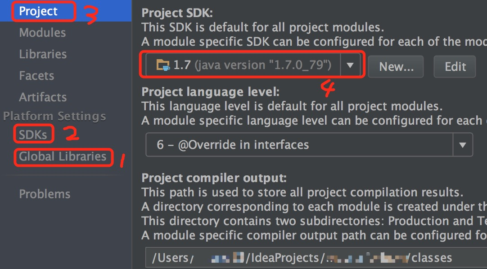

# idea使用手册

## 目录
- [安装](#install)
- [基本配置](#setting)
    - [按键设置](#keymap)
    - [jdk设置](#jdk)
    - [maven启动项目](#mavenrun)
    - [修改快捷键](#changekeymap)
- [插件](#plugin)
    - [gerrit](#gerrit)

## <a name="install">安装</a>
下载安装dmg文件，打开，选择License server：http://idea.iteblog.com/key.php

## <a name="setting">基本配置</a>
### <a name="keymap">按键设置</a>
```
打开idea，左上角
        ->preferences，搜索keymap，设置为eclipse按键风格
```

### <a name="jdk">jdk设置</a>
在idea右上角找到Project Structure图片
```
进入以后选择左侧菜单
        ->Global Libraries，选择+号，JAVA
            ->路径一般使用/Library/Java/JavaVirtualMachines/java版本//Contents/Home
        这个时候有，一般在Global Libraries菜单上面的SDKs就能看到自己配置的了。
        
        进入->Peoject菜单，选择刚才配置的jdk，保存
```
过程如图：<br>


### <a name="mavenrun">maven启动项目</a>
1. 找到配置位置：<br>
    
2. 选择Edit Configuration，新增一个，选择Maven，右侧选择项目，起名字，配置JVM参数。
3. 回到主界面，配置右侧有个绿色箭头，点击启动。

### <a name="changekeymap">修改快捷键</a>
按键风格修改成eclipse按键后，可以修改一些其他的键
```
搜索 implementations(s),双击或者右键，选择鼠标按键，按着command+鼠标左键即可。
搜索 find，找到edit目录下对应的功能，双击或者右键，选择键盘按键，按着command+f即可。
```


## <a name = "plugin">插件</a>
### <a name = "gerrit">gerrit</a>
```
这个插件能够提供refs/for的功能
首先preferences -> 搜索plugins, 点击Browse repositories -> 搜索gerrit，点击安装，然后重启idea
之后提交时候选择push，就可以看到push to gerrit的选项了，打勾，然后在上面输入/refs/for即可
```